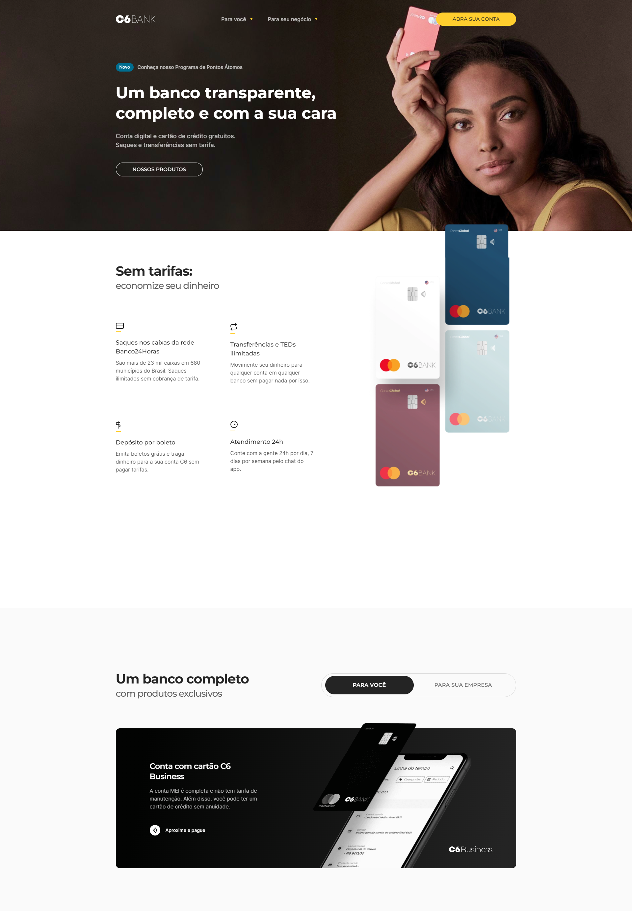

Projeto: C6 Bank

Esse projeto **C6 Banck**, é um projeto desenvolvido para praticar todo o meu conhecimento.

**C6 Bank** é uma instituição financeira brasileira que oferecia serviços bancários digitais. Ela foi fundada em 2019 e se destacou no mercado por sua abordagem moderna e foco na experiência do cliente.

## Screenshots

## Stack utilizada

- HTML
- CSS/SASS
- Javascrpit
- GulpJS
- AOS animation

## Criador & Autor

- [@WillMoreiraDev](https://www.linkedin.com/in/willmoreira/)

- [@Vitor-Linaris](https://www.linkedin.com/in/vitor-linaris-a33a95235/)

## 🔗 Links

